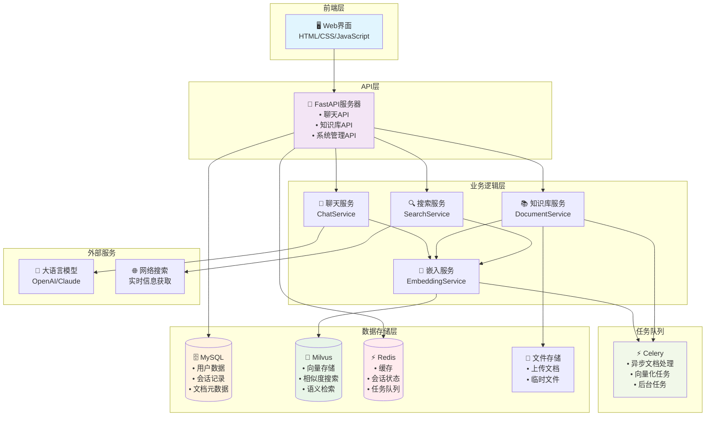

# SparkLink AI - 智能聊天助手系统

基于 FastAPI + Celery + Redis + MySQL + Milvus 构建的智能聊天助手系统，支持知识库增强和联网搜索。

## 🌟 主要特性

- **智能对话**: 基于大语言模型的高质量对话生成
- **知识库增强**: 支持文档上传、解析、向量化和智能检索
- **联网搜索**: 智能判断模式，知识库不足时自动联网搜索
- **流式响应**: 支持 SSE 流式对话，提供实时交互体验
- **异步处理**: 使用 Celery 处理文档解析和向量生成任务
- **多格式支持**: 支持 PDF、Word、PPT、图片等多种文档格式
- **用户会话管理**: 支持多用户、多会话的聊天管理
- **UUID用户系统**: 支持UUID格式的用户标识符
- **知识库分组**: 支持文档分组管理，便于组织和检索
- **软删除机制**: 支持文档和分组的软删除，保证数据完整性

## 🏗️ 系统架构



## 📊 数据库设计

### MySQL 表结构

#### 用户表 (users)
```sql
CREATE TABLE users (
    id VARCHAR(255) PRIMARY KEY,           -- 用户唯一标识
    username VARCHAR(255) NOT NULL,        -- 用户名
    email VARCHAR(255),                    -- 邮箱地址
    created_at TIMESTAMP DEFAULT CURRENT_TIMESTAMP,  -- 创建时间
    updated_at TIMESTAMP DEFAULT CURRENT_TIMESTAMP ON UPDATE CURRENT_TIMESTAMP  -- 更新时间
);
```

#### 聊天会话表 (chat_sessions)
```sql
CREATE TABLE chat_sessions (
    id VARCHAR(255) PRIMARY KEY,           -- 会话唯一标识
    user_id VARCHAR(255) NOT NULL,         -- 用户ID (外键)
    title VARCHAR(500),                    -- 会话标题
    created_at TIMESTAMP DEFAULT CURRENT_TIMESTAMP,  -- 创建时间
    updated_at TIMESTAMP DEFAULT CURRENT_TIMESTAMP ON UPDATE CURRENT_TIMESTAMP,  -- 更新时间
    FOREIGN KEY (user_id) REFERENCES users(id)
);
```

#### 聊天消息表 (chat_messages)
```sql
CREATE TABLE chat_messages (
    id INT AUTO_INCREMENT PRIMARY KEY,     -- 消息唯一标识
    session_id VARCHAR(255) NOT NULL,      -- 会话ID (外键)
    role ENUM('user', 'assistant') NOT NULL,  -- 消息角色
    content TEXT NOT NULL,                 -- 消息内容
    created_at TIMESTAMP DEFAULT CURRENT_TIMESTAMP,  -- 创建时间
    FOREIGN KEY (session_id) REFERENCES chat_sessions(id)
);
```

#### 知识库分组表 (document_groups)
```sql
CREATE TABLE document_groups (
    id INT AUTO_INCREMENT PRIMARY KEY,     -- 分组唯一标识
    group_name VARCHAR(255) NOT NULL,      -- 分组名称
    description TEXT,                      -- 分组描述
    user_id VARCHAR(255) NOT NULL,         -- 用户ID (外键)
    created_at TIMESTAMP DEFAULT CURRENT_TIMESTAMP,  -- 创建时间
    updated_at TIMESTAMP DEFAULT CURRENT_TIMESTAMP ON UPDATE CURRENT_TIMESTAMP,  -- 更新时间
    FOREIGN KEY (user_id) REFERENCES users(id)
);
```

#### 文档嵌入任务表 (document_embedding_tasks)
```sql
CREATE TABLE document_embedding_tasks (
    task_id VARCHAR(255) PRIMARY KEY,      -- 任务唯一标识
    doc_id VARCHAR(255) NOT NULL,          -- 文档ID
    doc_name VARCHAR(255) NOT NULL,        -- 文档名称
    file_path VARCHAR(500),                -- 文件路径
    content_type VARCHAR(100),             -- 内容类型
    user_id VARCHAR(255) NOT NULL,         -- 用户ID (外键)
    group_id INT,                          -- 分组ID (外键)
    status ENUM('pending', 'processing', 'completed', 'failed') DEFAULT 'pending',  -- 任务状态
    is_active BOOLEAN DEFAULT TRUE,        -- 是否激活 (软删除标记)
    created_at TIMESTAMP DEFAULT CURRENT_TIMESTAMP,  -- 创建时间
    updated_at TIMESTAMP DEFAULT CURRENT_TIMESTAMP ON UPDATE CURRENT_TIMESTAMP,  -- 更新时间
    FOREIGN KEY (user_id) REFERENCES users(id),
    FOREIGN KEY (group_id) REFERENCES document_groups(id)
);
```

### Milvus 向量数据库集合结构

#### 知识库向量集合 (sparklinkai_knowledge)
```python
# 集合字段定义
fields = [
    {
        "name": "id",                    # 主键ID
        "type": "VARCHAR",
        "max_length": 100,
        "is_primary": True,
        "auto_id": False
    },
    {
        "name": "doc_id",               # 文档ID
        "type": "VARCHAR", 
        "max_length": 200
    },
    {
        "name": "doc_name",             # 文档名称
        "type": "VARCHAR",
        "max_length": 500
    },
    {
        "name": "chunk_content",        # 文档分块内容
        "type": "VARCHAR",
        "max_length": 4000
    },
    {
        "name": "vector",               # 向量数据
        "type": "FLOAT_VECTOR",
        "dimension": 1024               # 向量维度 (根据嵌入模型调整)
    },
    {
        "name": "source_path",          # 源文件路径
        "type": "VARCHAR",
        "max_length": 1000
    },
    {
        "name": "doc_type",             # 文档类型
        "type": "VARCHAR",
        "max_length": 50
    },
    {
        "name": "user_id",              # 用户ID
        "type": "VARCHAR",
        "max_length": 50
    },
    {
        "name": "group_id",             # 分组ID
        "type": "INT64"
    },
    {
        "name": "create_at",            # 创建时间
        "type": "VARCHAR",
        "max_length": 20
    },
    {
        "name": "update_at",            # 更新时间
        "type": "VARCHAR",
        "max_length": 20
    }
]

# 索引配置
index_params = {
    "metric_type": "IP",                # 内积相似度 (适合归一化向量)
    "index_type": "IVF_FLAT",          # 索引类型
    "params": {"nlist": 1024}          # 索引参数
}
```

### 数据关系说明

1. **用户 → 会话**: 一对多关系，一个用户可以有多个聊天会话
2. **会话 → 消息**: 一对多关系，一个会话包含多条消息
3. **用户 → 知识库分组**: 一对多关系，一个用户可以创建多个知识库分组
4. **分组 → 文档任务**: 一对多关系，一个分组可以包含多个文档
5. **文档任务 → 向量数据**: 一对多关系，一个文档会被分块并生成多个向量

### 软删除机制

- 所有主要实体都支持软删除 (`is_active` 字段)
- 删除分组时会检查是否存在未删除的子文档
- 删除文档时会同时清理对应的向量数据
- 保证数据完整性和可恢复性

## 🚀 快速开始

### 环境要求

- Python 3.13+
- MySQL 8.0+
- Redis 5.0+
- Milvus 2.4+ (可选，用于向量存储)
- uv (Python 包管理器)

### 安装步骤

1. **克隆项目**
```bash
git clone git@github.com:lemonguess/sparklinkAI.git
cd sparklinkAI
```

2. **安装依赖**
```bash
# 使用 uv 管理依赖
uv sync
```

3. **配置环境变量**
```bash
# 创建 .env 文件，填入你的 API 密钥
vim .env
```

4. **配置数据库**
```bash
# 创建 MySQL 数据库
mysql -u root -p -e "CREATE DATABASE sparklinkai;"

# 启动 Redis
redis-server
```

5. **启动服务**
```bash
# 启动 FastAPI 服务
uv run uvicorn main:app --host 0.0.0.0 --port 8000 --reload 

# 启动 Celery Worker (新终端)
uv run python -m celery -A services.celery_app worker --loglevel=info 
```

6. **访问服务**
- API 文档: http://localhost:8000/docs
- 健康检查: http://localhost:8000/health

## 📝 配置说明

### .env 文件配置

```env
# SiliconFlow API 配置 (主要LLM和嵌入模型)
SILICONFLOW_API_KEY=your_siliconflow_api_key_here
SILICONFLOW_BASE_URL=https://api.siliconflow.cn/v1

# TextIn OCR API 配置
TEXTIN_API_KEY=your_textin_api_key_here
TEXTIN_API_SECRET=your_textin_api_secret_here

# Web 搜索 API 配置 (博查)
WEB_SEARCH_API_KEY=your_web_search_api_key_here

# 数据库配置
MYSQL_HOST=localhost
MYSQL_PORT=3306
MYSQL_USER=root
MYSQL_PASSWORD=your_mysql_password
MYSQL_DATABASE=sparklinkai

REDIS_HOST=localhost
REDIS_PORT=6379
REDIS_PASSWORD=
REDIS_DB=0

MILVUS_HOST=localhost
MILVUS_PORT=19530
```

### conf.ini 配置文件

系统的详细配置在 `config/conf.ini` 中，包括：
- 模型参数配置
- 知识库配置
- 搜索策略配置
- 性能参数配置

## 🔧 API 接口文档

### 聊天相关接口

#### 1. 发送聊天消息
```bash
POST /api/v1/chat/chat
Content-Type: application/json

{
    "message": "你好，请介绍一下人工智能",
    "user_id": "your-user-id",
    "session_id": "your-session-id",
    "use_knowledge_base": true,
    "use_web_search": true,
    "stream": false
}
```

#### 2. 流式聊天
```bash
POST /api/v1/chat/chat/stream
Content-Type: application/json

{
    "message": "你好，请介绍一下人工智能",
    "user_id": "your-user-id", 
    "session_id": "your-session-id",
    "use_knowledge_base": true,
    "use_web_search": true
}
```

#### 3. 创建聊天会话
```bash
POST /api/v1/chat/create-session
Content-Type: application/json

{
    "user_id": "your-user-id",
    "title": "新的聊天会话"
}
```

#### 4. 获取会话列表
```bash
GET /api/v1/chat/sessions?user_id=your-user-id&skip=0&limit=20
```

#### 5. 获取会话消息
```bash
GET /api/v1/chat/sessions/{session_id}/messages?skip=0&limit=50
```

#### 6. 删除会话
```bash
DELETE /api/v1/chat/sessions/{session_id}?user_id=your-user-id
```

#### 7. 更新会话标题
```bash
PUT /api/v1/chat/sessions/{session_id}/title
Content-Type: application/json

{
    "title": "新的会话标题"
}
```

#### 8. 停止流式响应
```bash
POST /api/v1/chat/stop-stream
Content-Type: application/json

{
    "request_id": "your-request-id"
}
```

### 知识库相关接口

#### 1. 创建知识库分组
```bash
POST /api/v1/kb/group/create
Content-Type: application/json

{
    "group_name": "我的知识库",
    "description": "用于存储相关文档的知识库",
    "user_id": "your-user-id"
}
```

#### 2. 获取知识库分组列表
```bash
GET /api/v1/kb/group/list?user_id=your-user-id&skip=0&limit=20
```

#### 3. 更新知识库分组
```bash
PUT /api/v1/kb/group/update/{group_id}?user_id=your-user-id
Content-Type: application/json

{
    "group_name": "更新后的知识库名称",
    "description": "更新后的描述"
}
```

#### 4. 删除知识库分组
```bash
DELETE /api/v1/kb/group/delete?group_id=1&user_id=your-user-id
```

#### 5. 获取分组内文档列表
```bash
POST /api/v1/kb/group/detail
Content-Type: application/json

{
    "group_id": 1,
    "user_id": "your-user-id"
}
```

#### 6. 上传文档文件
```bash
POST /api/v1/kb/tasks/file_process
Content-Type: multipart/form-data

file: [文档文件]
user_id: your-user-id
group_id: 1 (可选)
```

#### 7. 处理文本内容
```bash
POST /api/v1/kb/tasks/post_process
Content-Type: application/json

{
    "content": "要处理的文本内容",
    "title": "文档标题",
    "user_id": "your-user-id",
    "group_id": 1
}
```

#### 8. 获取任务状态
```bash
GET /api/v1/kb/tasks/{task_id}/status
```

#### 9. 删除文档
```bash
DELETE /api/v1/kb/document/delete?doc_id=your-doc-id&user_id=your-user-id
```

#### 10. 搜索知识库
```bash
POST /api/v1/kb/search
Content-Type: application/json

{
    "query": "人工智能的发展历史",
    "top_k": 10,
    "similarity_threshold": 0.7,
    "collection_name": "kb_12345678"
}
```

### 系统相关接口

#### 1. 健康检查
```bash
GET /health
```

#### 2. 系统状态
```bash
GET /api/v1/system/status
```

#### 3. 系统统计
```bash
GET /api/v1/system/stats
```

#### 4. 数据库状态
```bash
GET /api/v1/system/db-status
```

#### 5. 系统配置
```bash
GET /api/v1/system/config
```

## 🧠 智能搜索

### 智能决策策略

1. **知识库优先**: 首先搜索本地知识库
2. **智能判断**: 根据结果质量和置信度决定是否联网
3. **动态调整**: 根据查询类型调整搜索策略
4. **结果融合**: 智能合并和排序多源结果

### 决策因子

- 结果数量阈值
- 置信度阈值
- 覆盖度评估
- 查询类型分析
- 质量分数计算

### 使用示例

```python
from services.chat_service import ChatService, SearchStrategy

# 创建聊天服务实例
chat_service = ChatService()

# 方式1: 智能搜索
result = await chat_service.intelligent_search(
    query="人工智能的最新发展",
    strategy=SearchStrategy.AUTO,
    max_results=10
)

print(f"搜索策略: {result['strategy']}")
print(f"决策原因: {result['decision_reasoning']}")
print(f"结果数量: {result['total_results_count']}")
print(f"使用框架: {result['performance_metrics']['framework']}")

# 方式2: 智能聊天（自动搜索+生成回复）
response = await chat_service.intelligent_chat(
    message="请介绍人工智能的最新发展",
    strategy=SearchStrategy.AUTO
)

print(f"AI回复: {response}")
```

## 📊 系统监控

### 健康检查

```bash
# 检查系统状态
curl http://localhost:8000/health

# 检查系统信息
curl http://localhost:8000/api/v1/system/status

# 获取系统统计信息
curl http://localhost:8000/api/v1/system/stats

# 检查数据库连接
curl http://localhost:8000/api/v1/system/db-status
```

### 性能指标

- 响应时间监控（通过 X-Process-Time 头部）
- 搜索质量评估
- 资源使用统计
- 任务执行状态
- 数据库连接状态
- Redis 连接状态

## 🔄 开发指南

### 项目结构

```
sparklinkAI/
├── api/                     # API 路由
│   ├── chat.py              # 聊天相关接口
│   ├── knowledge_base.py    # 知识库相关接口
│   └── system.py            # 系统相关接口
├── core/                    # 核心配置
│   ├── config.py            # 配置管理
│   └── database.py          # 数据库连接
├── models/                  # 数据模型
│   ├── database.py          # 数据库模型
│   └── schemas.py           # Pydantic 模型
├── services/                # 业务服务
│   ├── chat_service.py      # 聊天服务
│   ├── document_service.py  # 文档处理服务
│   ├── embedding_service.py # 嵌入向量服务
│   ├── knowledge_service.py # 知识库服务
│   ├── search_service.py    # 搜索服务
│   ├── vector_service.py    # 向量数据库服务
│   ├── celery_app.py        # Celery 应用配置
│   └── tasks/               # Celery 任务
│       ├── document_tasks.py    # 文档处理任务
│       ├── embedding_tasks.py   # 嵌入向量任务
│       └── search_tasks.py      # 搜索任务
├── config/                  # 配置文件
│   └── conf.ini             # 系统配置
├── static/                  # 静态文件
│   ├── css/                 # 样式文件
│   ├── js/                  # JavaScript 文件
│   └── libs/                # 第三方库
├── templates/               # 模板文件
│   └── index.html           # 主页模板
├── utils/                   # 工具模块
├── .env                     # 环境变量
├── main.py                  # 主程序入口
├── celery_worker.py         # Celery Worker
├── pyproject.toml           # 项目依赖配置
└── docker-compose.yml       # Docker 编排配置
```

### 添加新功能

1. **添加新的API端点**
   - 在 `api/` 下创建新的路由文件
   - 在 `main.py` 中注册路由

2. **添加新的服务**
   - 在 `services/` 下创建服务类
   - 实现业务逻辑和外部API调用

3. **添加新的任务**
   - 在 `services/tasks/` 下创建任务文件
   - 使用 `@celery_app.task` 装饰器

### 开发工具

```bash
# 安装开发依赖
uv add --dev pytest pytest-cov black isort

# 代码格式化
uv run black .
uv run isort .

# 运行测试（需要先安装pytest）
uv run pytest

# 测试覆盖率
uv run pytest --cov=.
```

## 🚀 部署

### Docker 部署

```bash
# 构建镜像
docker build -t sparklinkai .

# 运行容器
docker-compose up -d
```

### 生产环境

1. 使用 Gunicorn 或 uWSGI 部署 FastAPI
2. 使用 Nginx 作为反向代理
3. 配置 SSL 证书
4. 设置监控和日志

## 🤝 贡献

欢迎提交 Issue 和 Pull Request！

1. Fork 项目
2. 创建特性分支
3. 提交更改
4. 推送到分支
5. 创建 Pull Request

## 📄 许可证

MIT License

## 🙏 致谢

- [FastAPI](https://fastapi.tiangolo.com/) - 现代化的 Python Web 框架
- [Celery](https://docs.celeryproject.org/) - 分布式任务队列
- [SQLAlchemy](https://www.sqlalchemy.org/) - Python SQL 工具包和 ORM
- [Redis](https://redis.io/) - 内存数据结构存储
- [MySQL](https://www.mysql.com/) - 关系型数据库
- [Milvus](https://milvus.io/) - 向量数据库
- [uv](https://github.com/astral-sh/uv) - 极速 Python 包管理器
- [SiliconFlow](https://siliconflow.cn/) - AI 模型服务平台