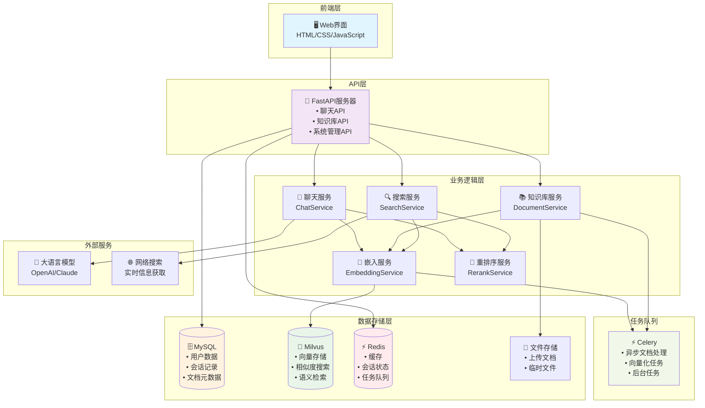

# SparkLink AI - 智能聊天助手系统

基于 FastAPI + Celery + Redis + MySQL + Milvus 构建的智能聊天助手系统，支持知识库增强和联网搜索。

## 🌟 主要特性

- **智能对话**: 基于大语言模型的高质量对话生成
- **知识库增强**: 支持文档上传、解析、向量化和智能检索
- **联网搜索**: 智能判断模式，知识库不足时自动联网搜索
- **流式响应**: 支持 SSE 流式对话，提供实时交互体验
- **异步处理**: 使用 Celery 处理文档解析和向量生成任务
- **多格式支持**: 支持 PDF、Word、PPT、图片等多种文档格式
- **用户会话管理**: 支持多用户、多会话的聊天管理
- **UUID用户系统**: 支持UUID格式的用户标识符
- **知识库分组**: 支持文档分组管理，便于组织和检索
- **软删除机制**: 支持文档和分组的软删除，保证数据完整性
- **重排序优化**: 集成 rerank 服务，提升检索结果相关性
- **OCR文字识别**: 支持图片文字提取，扩展文档处理能力
- **现代化UI**: 响应式Web界面，支持多种交互模式

## 🔧 技术栈

### 后端技术
- **框架**: FastAPI (高性能异步 Web 框架)
- **数据库**: MySQL (关系型数据库)
- **缓存**: Redis (内存数据库)
- **向量数据库**: Milvus (向量相似性搜索)
- **任务队列**: Celery (分布式任务队列)
- **消息代理**: Redis (Celery broker)
- **依赖管理**: uv (现代 Python 包管理器)

### AI 服务
- **LLM 服务**: SiliconFlow API (大语言模型)
- **嵌入模型**: 支持多种嵌入模型
- **重排序**: 智能搜索结果重排序
- **OCR 识别**: TextIn OCR API

### 前端技术
- **模板引擎**: Jinja2
- **样式**: 现代化 CSS3
- **脚本**: 原生 JavaScript
- **UI 组件**: 响应式设计
- **Markdown**: marked.js 解析器

## 🏗️ 系统架构



## 🚀 快速开始

### 环境要求

- Python 3.13+
- MySQL 8.0+
- Redis 5.0+
- Milvus 2.5+ (可选，用于向量存储)
- uv (Python 包管理器)

### 安装步骤

1. **克隆项目**
```bash
git clone git@github.com:lemonguess/sparklinkAI.git
cd sparklinkAI
```

2. **安装依赖**
```bash
# 使用 uv 管理依赖
uv sync
```

3. **配置环境变量**
```bash
# 复制环境变量示例文件
cp .env.example .env

# 编辑 .env 文件，填入你的 API 密钥
vim .env
```

4. **启动服务**
```bash
# 启动 FastAPI 服务
uv run uvicorn main:app --host 0.0.0.0 --port 8000 --reload 

# 启动 Celery Worker (新终端)
uv run python celery_worker.py
# uv run python -m celery -A services.celery_app worker --loglevel=info 
```

5. **访问服务**
- Web 界面: http://localhost:8000
- API 文档: http://localhost:8000/docs
- 健康检查: http://localhost:8000/health

## 📝 配置说明

### .env 文件配置

```env
# SiliconFlow API 配置 (主要LLM和嵌入模型)
SILICONFLOW_API_KEY=your-api-key
SILICONFLOW_BASE_URL=https://api.siliconflow.cn/v1

# TextIn OCR API 配置
TEXTIN_API_KEY=your_textin_api_key_here
TEXTIN_API_SECRET=your_textin_api_secret_here

# Web 搜索 API 配置 (博查)
WEB_SEARCH_API_KEY=your-web-search-api-key

# 数据库配置
MYSQL_HOST=localhost
MYSQL_PORT=3306
MYSQL_USER=root
MYSQL_PASSWORD=your_mysql_password
MYSQL_DATABASE=sparklinkai

# Redis 配置
REDIS_HOST=localhost
REDIS_PORT=6379
REDIS_PASSWORD=
# 短期记忆缓存配置（聊天历史临时存储，24小时过期）
REDIS_CHAT_MEMORY_DB=5

# Celery 配置 (使用不同的Redis数据库)
CELERY_BROKER_DB=1
CELERY_RESULT_DB=2

# Milvus 配置
MILVUS_HOST=localhost
MILVUS_PORT=19530
MILVUS_USER=
MILVUS_PASSWORD=
MILVUS_COLLECTION_NAME=sparklinkai_knowledge

# 应用配置
APP_HOST=0.0.0.0
APP_PORT=8000
APP_DEBUG=True
```

### conf.ini 配置文件

系统的详细配置在 `config/conf.ini` 中，包括：
- 模型参数配置
- 知识库配置
- 搜索策略配置
- 性能参数配置

## 🔄 开发指南

### 项目结构

```
sparklinkAI/
├── api/                     # API 路由
│   ├── chat.py              # 聊天相关接口
│   ├── knowledge_base.py    # 知识库相关接口
│   └── system.py            # 系统相关接口
├── basereal.py              # 实时交互基础类（支持闲置监控）
├── core/                    # 核心配置
│   ├── config.py            # 配置管理
│   └── database.py          # 数据库连接
├── models/                  # 数据模型
│   ├── database.py          # 数据库模型
│   ├── enums.py             # 枚举定义
│   └── schemas.py           # Pydantic 模型
├── services/                # 业务服务
│   ├── chat_service.py      # 聊天服务
│   ├── document_service.py  # 文档处理服务
│   ├── embedding_service.py # 嵌入向量服务
│   ├── rerank_service.py    # 重排序服务
│   ├── search_service.py    # 搜索服务
│   ├── vector_service.py    # 向量数据库服务
│   ├── celery_app.py        # Celery 应用配置
│   └── tasks/               # Celery 任务
│       └── embedding_tasks.py   # 嵌入向量任务
├── config/                  # 配置文件
│   └── conf.ini             # 系统配置
├── static/                  # 静态文件
│   ├── css/                 # 样式文件
│   │   ├── chat.css         # 聊天界面样式
│   │   ├── common.css       # 通用样式
│   │   ├── knowledge.css    # 知识库界面样式
│   │   └── style.css        # 主样式文件
│   ├── images/              # 图片资源
│   │   └── favicon.svg      # 网站图标
│   ├── js/                  # JavaScript 文件
│   │   ├── app.js           # 主应用脚本
│   │   ├── chat.js          # 聊天功能脚本
│   │   ├── knowledge.js     # 知识库功能脚本
│   │   └── utils.js         # 工具函数
│   └── libs/                # 第三方库
│       └── marked.min.js    # Markdown 解析库
├── templates/               # 模板文件
│   ├── base.html            # 基础模板
│   ├── chat.html            # 聊天页面
│   ├── index.html           # 主页模板
│   ├── knowledge.html       # 知识库页面
│   └── modals/              # 模态框组件
│       └── common_modals.html
├── utils/                   # 工具模块
│   ├── extract_keyword.py   # 关键词提取
│   └── user_utils.py        # 用户工具函数
├── .env.example             # 环境变量示例
├── .gitignore               # Git 忽略文件
├── .python-version          # Python 版本配置
├── Dockerfile               # Docker 镜像配置
├── delete_remaining_tables.py # 数据库清理脚本
├── docker-compose.yml       # Docker 编排配置
├── main.py                  # 主程序入口
├── celery_worker.py         # Celery Worker
├── pyproject.toml           # 项目依赖配置
├── reset_database.py        # 数据库重置脚本
└── uv.lock                  # 依赖锁定文件
```


## 🚀 部署

### Docker 部署

```bash
# 构建镜像
docker build -t sparklinkai .

# 运行容器
docker-compose up -d
```


## 📄 许可证

MIT License

## 🙏 致谢

- [FastAPI](https://fastapi.tiangolo.com/) - 现代化的 Python Web 框架
- [Celery](https://docs.celeryproject.org/) - 分布式任务队列
- [SQLAlchemy](https://www.sqlalchemy.org/) - Python SQL 工具包和 ORM
- [Redis](https://redis.io/) - 内存数据结构存储
- [MySQL](https://www.mysql.com/) - 关系型数据库
- [Milvus](https://milvus.io/) - 向量数据库
- [uv](https://github.com/astral-sh/uv) - 极速 Python 包管理器
- [SiliconFlow](https://siliconflow.cn/) - AI 模型服务平台